# AI Resume Intelligence Platform

[](https://github.com/joel8779/mlops-ai/actions/workflows/frontend-ci.yml)
[](https://github.com/joel8779/mlops-ai/actions/workflows/backend-ci.yml)
[](https://github.com/joel8779/mlops-ai/actions/workflows/docker-ci.yml)
[](https://github.com/joel8779/mlops-ai/commits/main)


An enterprise-grade, multi-tenant Applicant Tracking System (ATS) and Resume Intelligence platform. Powered by hybrid semantic ranking, structured resume parsing, RAG-enabled recruitment assistance, and strict tenant isolation.

---

## 📸 Platform Previews

### 🌐 Welcome & Workspace Onboarding
| 01. Cyberpunk Landing Portal | 02. Tenant Signup & Onboarding |
| --- | --- |
| 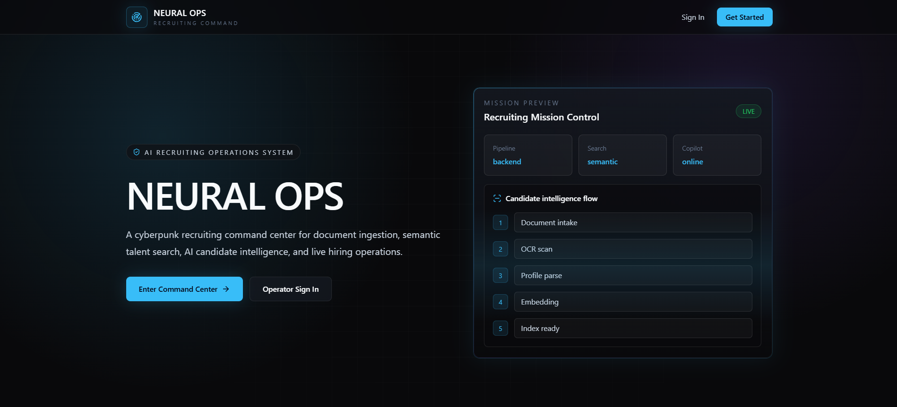 | 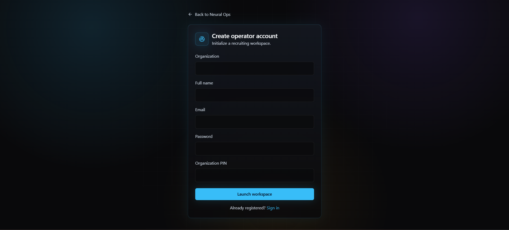 |

### 📊 Recruiter Operations Command Center
| 03. Operations Command Dashboard | 04. Resume Ingestion & Parsing |
| --- | --- |
| 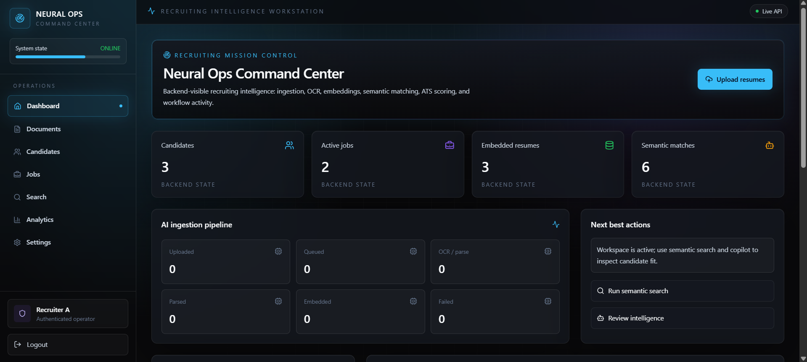 | 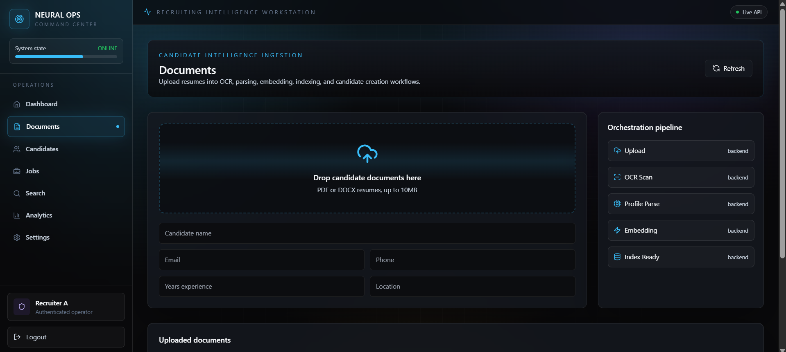 |

### 👤 Candidate Profile & AI Intelligence
| 05. Recruiter Briefing & Profile | 06. AI Summary & Evaluation |
| --- | --- |
| 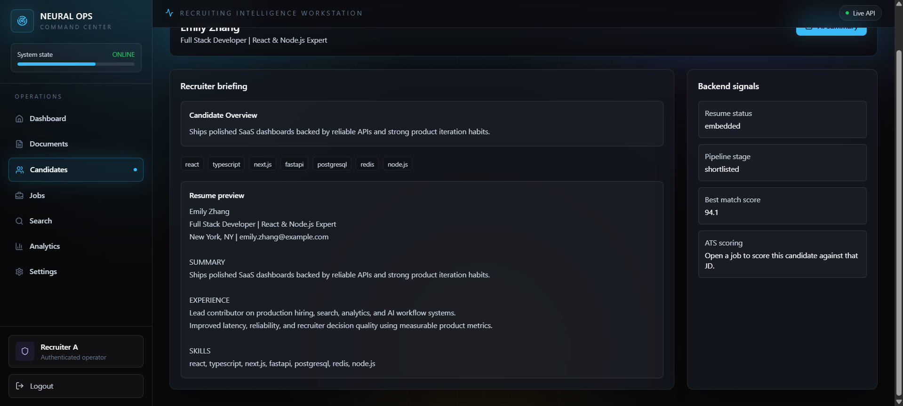 | 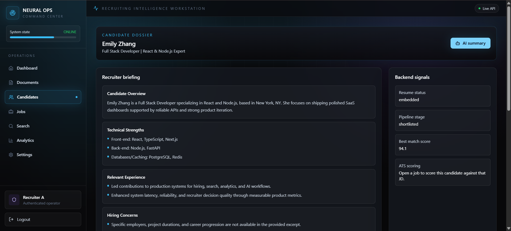 |

### 💼 Jobs Management & AI Semantic Search
| 07. Role Command Deck (Jobs) | 08. Neural Search (Semantic Queries) |
| --- | --- |
| 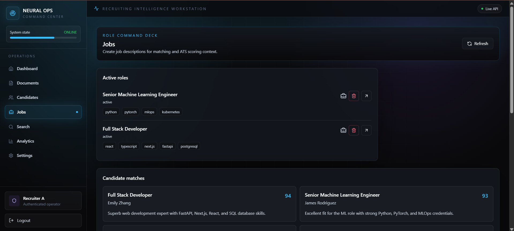 | 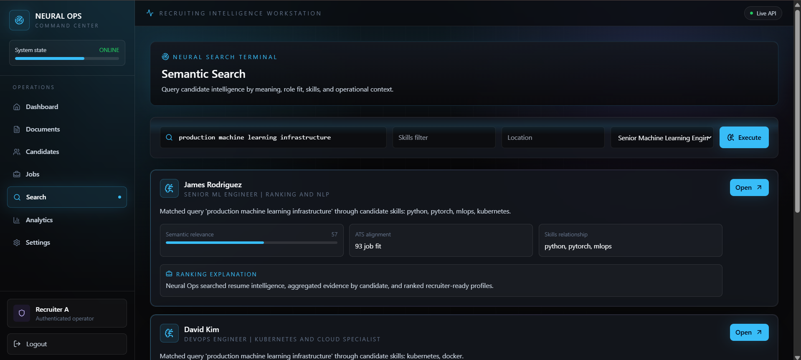 |

### ⚙️ Operational Telemetry & System Controls
| 09. Analytics & Top Skills Telemetry | 10. Workspace & Session Settings |
| --- | --- |
| 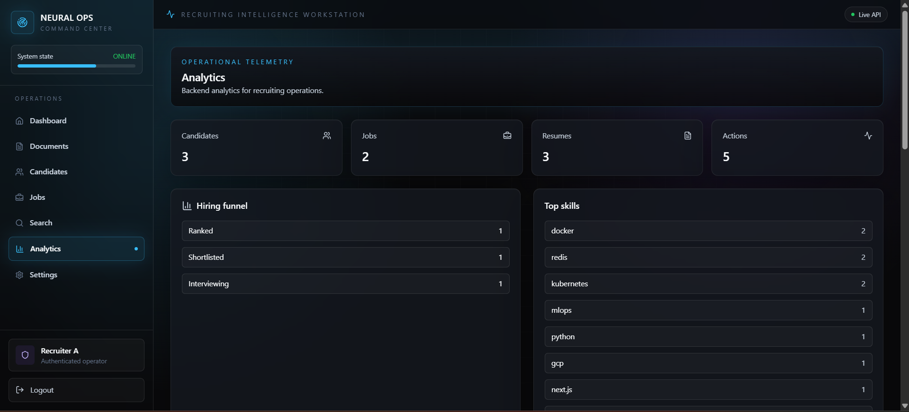 | 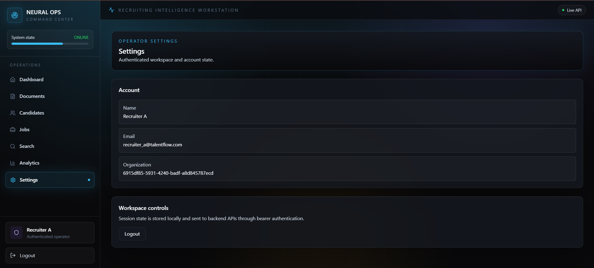 |

---


## 📖 Overview

The **AI Resume Intelligence Platform** is built to modernize high-scale recruitment pipelines. Unlike traditional keyword-based ATS tools, this platform extracts deep semantic meaning from applicant profiles. It combines strict multi-tenant database isolation, async Celery worker task queues, and vector search indexing via Qdrant with large language model context matching to provide recruiters with a secure and context-aware workspace.

---

## 🛠️ Core Features

- **Multi-Tenant Isolation**: Rigid logical separation of data at the organization level (`organization_id` filters applied across all tables and vector database payloads).
- **Structured Resume Ingestion**: Async parsing pipelines extracting skills, experience timelines, education, and summaries from PDFs, Word documents, and images.
- **Hybrid ATS Matching**: Custom matching engine scoring applicants based on:
  - Vector similarity of resume text to the job description (using Qdrant).
  - Skill overlap (Jaccard similarity index on normalized candidate skills vs. job requirements).
  - Experience timeline matching (years of experience comparison).
  - Keyword density metrics.
- **Recruiter Command Center**: Interactive kanban board for moving applicants across stages (`ranked`, `shortlisted`, `interviewing`, `rejected`, `hired`), logging notes, and activity auditing.
- **Security-First Foundations**: Magic-number file scanners, Redis-based sliding window rate-limiting, double JWT token authentication (access + refresh), and PII masking.

---

## 🏗️ System Architecture

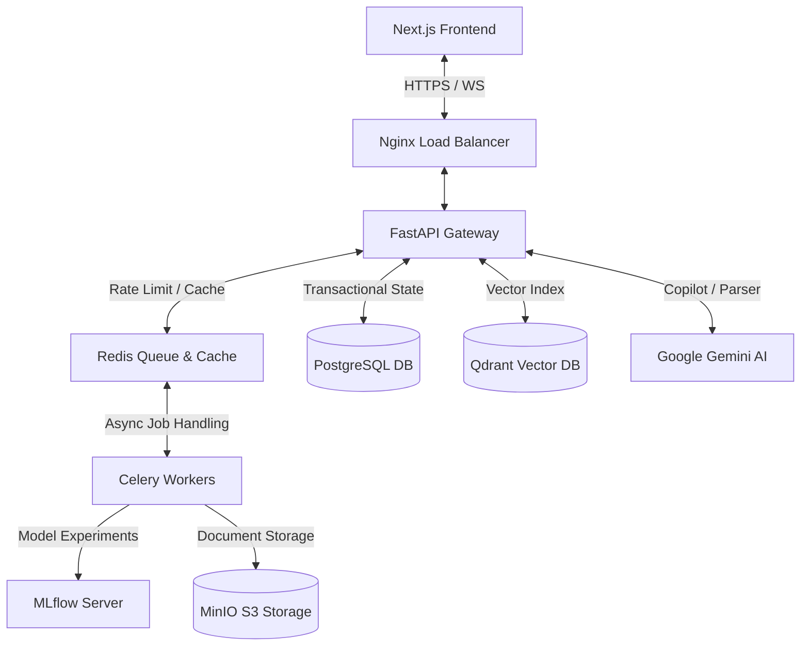

### Technology Stack

| Layer | Technologies |
|---|---|
| **Frontend** | React 18, Next.js 15, TypeScript 5.4, TailwindCSS, Zustand, Recharts, React Query |
| **Backend Gateway** | Python 3.11, FastAPI 0.115, SQLAlchemy 2.0 (AsyncPG), Alembic migrations |
| **Task Queue & Caching** | Celery, Redis 7 (sliding window rate-limiter, streams broker) |
| **Vector DB** | Qdrant 1.12 (HNSW-indexed vector search, payload filtering) |
| **Object Storage** | MinIO (local S3 API parity for resume document hosting) |
| **AI / Embeddings** | Gemini Pro 2.5 (parsing, copilot), SentenceTransformers (`all-MiniLM-L6-v2`) |
| **Telemetry & Observability** | Prometheus, Grafana, OpenTelemetry, MLflow |

---

## 📂 Folder Structure

```
├── apps/
│   ├── api/                 # FastAPI Backend app (models, api endpoints, workers)
│   └── web/                 # Next.js Frontend portal (UI dashboard, auth, components)
├── packages/
│   └── shared/              # Placeholder for shared libraries
├── infra/
│   ├── nginx/               # Nginx reverse-proxy config
│   ├── k8s/                 # Kubernetes secret and deployment manifests
│   ├── helm/                # Helm charts for automated stack installs
│   └── terraform/           # Terraform config files
├── docs/
│   ├── screenshots/         # Captured screenshot files
│   └── *.md                 # System validation reports and architectures
├── scripts/
│   ├── reset_dev_data.py    # Purges development database and vector collections
│   └── seed_talentflow_demo.py  # Populates the demo workspace data
└── docker-compose.yml       # Dev/production service orchestrator
```

---

## ⚡ Core Flows

### 1. The AI Ingestion Pipeline
1. **Upload**: Recruiter uploads a PDF, DOCX, or image resume.
2. **Scanner Validation**: File bytes are scanned for magic numbers (e.g. `%PDF-1.4`) to prevent malicious renaming scripts.
3. **Storage**: The file is saved to S3/MinIO bucket.
4. **Extraction**: Gemini parses the file contents into structured JSON schemas (skills, work history, education).
5. **Embedding**: Extracted text chunks are processed through a local sentence transformer model to generate 384-dimensional dense vectors.
6. **Upsert**: Vectors are loaded into Qdrant indexed by `organization_id` and `owner_id`.

### 2. Hybrid ATS Score Generation
When candidate resumes are evaluated against a Job Description (JD), the platform executes a hybrid score matrix:
```
Overall Match Score = (w1 * Vector_Similarity) + (w2 * Skill_Overlap) + (w3 * Experience_Match) + (w4 * Keyword_Overlap)
```
- **Vector Similarity**: Distance score of the candidate's resume embedding vs. job description query vector.
- **Skill Overlap**: Calculated on matching required and optional skills.
- **Experience Match**: Penalizes candidates falling below the years of experience floor specified in the JD.

---

## 🚀 Local Development Setup

### 1. Prerequisites
- Docker and Docker Compose installed.
- Python 3.11+ and Node.js 18+ (for running applications locally outside Docker).

### 2. Startup Infrastructure
Start all core databases, vector spaces, and queue backends:
```bash
docker compose up -d postgres redis qdrant minio mlflow
```

### 3. Setup Backend API
1. Navigate to the backend directory and configure the environment:
   ```bash
   cd apps/api
   cp .env.example .env
   ```
2. Create a virtual environment and install dependencies:
   ```bash
   python -m venv .venv
   Source-env:
     # Windows:
     .venv\Scripts\activate
     # Linux/macOS:
     source .venv/bin/activate
   pip install -r requirements-core.txt -r requirements-worker.txt
   ```
3. Run Alembic database migrations:
   ```bash
   alembic upgrade head
   ```
4. Start the FastAPI development server:
   ```bash
   uvicorn app.main:create_app --reload --host 0.0.0.0 --port 8000
   ```

### 4. Setup Frontend Portal
1. Navigate to the frontend directory:
   ```bash
   cd ../../apps/web
   npm install
   ```
2. Launch the Next.js development server:
   ```bash
   npm run dev
   ```

### 5. Seed Database with Portfolio Data
Populate the database with a clean, fully-indexed workspace:
```bash
# In the root workspace folder:
.venv\Scripts\python scripts\seed_talentflow_demo.py
```
This script configures:
- **Organization**: `TalentFlow`
- **User / Credentials**: `recruiter_a@talentflow.com` (Password: `demo123`)
- **Data**: 2 Jobs, 3 Candidates, and pre-calculated hybrid matching matrix results.

---

## 🔒 Security Practices

- **Bcrypt Hashing**: Secure password encryption stored in the PostgreSQL database.
- **Sliding-Window Rate-Limiter**: Implemented in Redis to protect authentication endpoints from brute-force attempts.
- **Tenant Isolation Constraint**: SQL queries join the user session context `organization_id` directly, ensuring no cross-org leakages can occur.
- **Sanitizers & Scanners**: Reject scripts, mask sensitive data, and enforce magic file header verification.

---

## 🚀 Deployment Parity

This repository contains deployment configurations matching modern cloud platforms:
- **Vercel** (`apps/web/vercel.json`): Configurations for the Next.js frontend.
- **Railway** (`apps/api/railway.toml`): Configurations for backend migrations, health checks, and running web/worker scaling components.
- **Kubernetes** (`infra/k8s/`): Deployment manifests for scalable containers.
- **Nginx** (`infra/nginx/nginx.conf`): Stateless load balancing setup.

---

## 📝 License

Distributed under the MIT License. See [LICENSE](LICENSE) for details.
