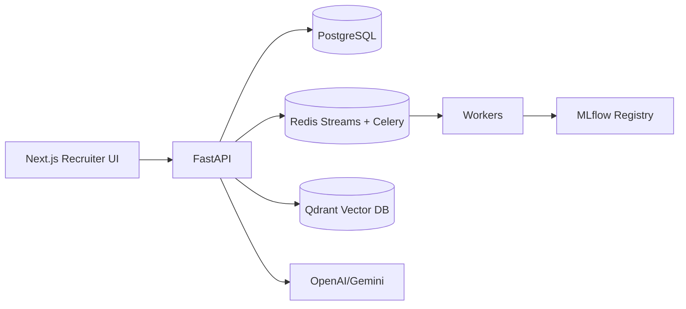

# AI Resume Intelligence Platform

[](.github/workflows/backend-ci.yml)
[](.github/workflows/frontend-ci.yml)
[](docs/ml-architecture.md)

Enterprise-grade AI hiring infrastructure for resume intelligence, semantic candidate search, recruiter workflows, learning-to-rank, and RAG copilot experiences.

## Highlights

- FastAPI, PostgreSQL, SQLAlchemy 2.0 async, Alembic, Redis, Celery
- Qdrant vector search with resume and job description embeddings
- Hybrid and ML-powered candidate ranking with recruiter feedback learning
- ATS scoring, AI summaries, interview question generation, candidate comparison
- Advanced RAG recruiter copilot with retrieval routing, reranking, compression, and citations
- Multi-tenant SaaS primitives: RBAC, quotas, API keys, audit logs
- Observability: Prometheus metrics, structured logs, OpenTelemetry tracing hooks
- Production DevOps: Docker Compose, GitHub Actions, Kubernetes, Helm, Terraform starters
- Next.js recruiter dashboard with search, jobs, analytics, candidate profiles, and copilot UI

## Architecture



## Quick Start

```bash
cp .env.example .env
docker compose up --build
docker compose exec api alembic upgrade head
```

Frontend:

```bash
cd apps/web
npm install
npm run dev
```

Backend docs: `http://localhost:8000/docs`

## ML Pipeline

The platform starts with hybrid ranking and learns from recruiter actions. Feedback events produce reward labels for pairwise XGBoost ranking, tracked through MLflow and served through an online inference service.

## RAG Copilot

Recruiter questions are rewritten, routed through hybrid retrieval, reranked, compressed, and grounded with candidate citations before LLM generation.

## Observability

Metrics cover API latency, embedding latency, ranking latency, retrieval latency, LLM cost, recruiter actions, and WebSocket activity.

## Screenshots and Demo GIFs

Add screenshots of dashboard, semantic search, candidate profile, analytics, and copilot flows in `docs/assets/`.

## Deployment

Kubernetes manifests live in `infra/k8s`, Helm starter in `infra/helm/resume-intelligence`, and Terraform starter in `infra/terraform`.
