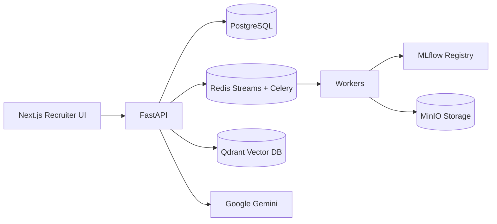

# AI Resume Intelligence Platform

[](.github/workflows/backend-ci.yml)
[](.github/workflows/frontend-ci.yml)
[](.github/workflows/security-ci.yml)
[](.github/workflows/docker-ci.yml)
[](docs/ml-architecture.md)

Enterprise-grade AI hiring infrastructure for resume intelligence, semantic candidate search, recruiter workflows, learning-to-rank, and RAG copilot experiences.

## 🚀 Features

### AI-Powered Recruiting
- **Semantic Search**: Find candidates using natural language queries with vector embeddings
- **AI Copilot**: RAG-powered assistant for answering recruiting questions with citations
- **Candidate Ranking**: Hybrid scoring combining semantic similarity, skills, experience, and feedback
- **ATS Scoring**: Automated resume scoring against job descriptions
- **Interview Generation**: AI-generated interview questions tailored to candidates and roles
- **Candidate Comparison**: AI-powered comparison of multiple candidates

### Resume Intelligence
- **OCR Extraction**: Extract text from PDF, DOCX, and image resumes
- **Skill Extraction**: Automatic skill identification and normalization
- **Embedding Generation**: Vector embeddings for semantic search
- **Resume Parsing**: Structured data extraction from unstructured resumes

### Recruiter Workflows
- **Pipeline Management**: Track candidates through hiring stages
- **Recruiter Notes**: Add and view notes on candidates
- **Bookmarks**: Save candidates for later review
- **Activity Tracking**: Log all recruiter actions
- **Feedback Loop**: Learn from recruiter decisions

### Analytics & Insights
- **Executive Dashboard**: High-level hiring metrics
- **Hiring Funnel**: Visualize pipeline conversion
- **Skill Analytics**: Track skill demand and trends
- **Recruiter Efficiency**: Measure productivity and automation
- **Ranking Accuracy**: Monitor AI model performance

### Enterprise Features
- **Multi-tenant**: Organization-based data isolation
- **RBAC**: Role-based access control (admin, recruiter)
- **Audit Logging**: Track all system actions
- **API Keys**: Secure API access for integrations
- **Rate Limiting**: Protect against abuse
- **Webhooks**: Real-time event notifications

## 🏗️ Architecture



### Tech Stack

**Backend**
- FastAPI 0.115+ (Python 3.11+)
- PostgreSQL 15+ with AsyncPG
- Redis 7+ (caching, streams, Celery broker)
- Qdrant 1.7+ (vector database)
- MinIO/S3 (object storage)
- Celery (async task processing)
- MLflow (ML experiment tracking)
- Google Gemini 2.5 (LLM)
- sentence-transformers (embeddings)

**Frontend**
- Next.js 15 (React 18)
- TypeScript 5.4+
- TailwindCSS (styling)
- React Query (data fetching)
- Zustand (state management)
- Recharts (data visualization)

**DevOps**
- Docker & Docker Compose
- GitHub Actions (CI/CD)
- Kubernetes (orchestration)
- Helm (package management)
- Prometheus & Grafana (monitoring)
- OpenTelemetry & Jaeger (tracing)
- Loki (log aggregation)

## 📸 Screenshots

### Dashboard

*Executive dashboard with hiring funnel, top skills, and efficiency metrics*

### Semantic Search

*Natural language search with skill filters and location filtering*

### AI Copilot

*RAG-powered assistant with citations and confidence scores*

### Candidate Profile

*Detailed candidate view with skills, resume, and match scores*

### Analytics

*Hiring analytics with funnel visualization and skill trends*

## 🎬 Demo GIFs

### Resume Upload

*Upload and process resumes with AI extraction*

### Candidate Ranking

*Rank candidates with AI-powered scoring*

### Interview Generation

*Generate interview questions with AI*

## 🚀 Quick Start

### Prerequisites
- Docker & Docker Compose
- Python 3.11+
- Node.js 18+
- PostgreSQL 15+
- Redis 7+

### Local Development

```bash
# Clone the repository
git clone https://github.com/yourusername/mlops-ai.git
cd mlops-ai

# Copy environment file
cp .env.example .env

# Start infrastructure
docker compose up -d postgres redis qdrant minio

# Run database migrations
docker compose exec api alembic upgrade head

# Start backend
cd apps/api
uvicorn app.main:create_app --reload --host 0.0.0.0 --port 8000

# Start frontend (new terminal)
cd apps/web
npm install
npm run dev
```

### Seed Demo Data

```bash
cd apps/api
python scripts/seed_demo_data.py
```

This creates:
- 3 organizations
- 4 recruiters
- 3 job descriptions
- 5 candidates with resumes
- Candidate matches, pipeline stages, and analytics

### Access Points

- **Frontend**: http://localhost:3000
- **Backend API**: http://localhost:8000
- **API Docs**: http://localhost:8000/docs
- **Health Check**: http://localhost:8000/health
- **Metrics**: http://localhost:8000/metrics

## 📖 Documentation

- [Architecture](docs/architecture.md) - System architecture and data flows
- [API Route Audit](docs/api-route-audit.md) - API endpoint validation
- [Auth Validation](docs/auth-validation.md) - Authentication flow
- [Resume Ingestion](docs/resume-ingestion-validation.md) - Resume processing pipeline
- [Gemini Validation](docs/gemini-validation.md) - AI integration
- [Semantic Search](docs/semantic-search-validation.md) - Search implementation
- [Frontend Integration](docs/frontend-backend-integration.md) - Frontend/backend connection
- [Demo Scenarios](docs/demo-scenarios.md) - Demo walkthroughs

## 🔒 Security

- JWT authentication with refresh tokens
- Bcrypt password hashing
- Role-based access control (RBAC)
- Organization-level data isolation
- Rate limiting
- CORS configuration
- SQL injection prevention
- XSS protection
- PII masking in logs
- Audit logging

## 📊 Observability

- **Metrics**: Prometheus (API latency, embedding latency, ranking latency, LLM cost)
- **Logs**: Structured JSON logs with Loki
- **Tracing**: OpenTelemetry with Jaeger
- **Health Checks**: `/health`, `/ready`, `/live` endpoints
- **Error Tracking**: Structured error logging

## 🚢 Deployment

### Docker Compose

```bash
docker compose up -d
```

### Kubernetes

```bash
kubectl apply -f infra/k8s/
```

### Helm

```bash
helm install resume-intelligence infra/helm/resume-intelligence
```

### Terraform

```bash
cd infra/terraform
terraform init
terraform apply
```

## 🧪 Testing

```bash
# Backend tests
cd apps/api
pytest

# Frontend tests
cd apps/web
npm test

# Integration tests
pytest tests/integration/
```

## 🤝 Contributing

1. Fork the repository
2. Create a feature branch
3. Make your changes
4. Run tests
5. Submit a pull request

## 📝 License

MIT License - see LICENSE file for details

## 🙏 Acknowledgments

- FastAPI for the excellent web framework
- Qdrant for the vector database
- Google for Gemini AI
- sentence-transformers for embeddings
- The open-source community

## 📞 Contact

- **Issues**: GitHub Issues
- **Discussions**: GitHub Discussions
- **Email**: your.email@example.com

---

Built with ❤️ for modern recruiting teams
