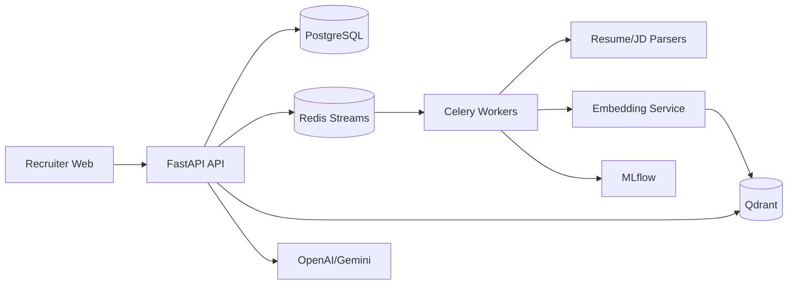

# Architecture

AI Resume Intelligence is a multi-tenant hiring intelligence platform built around FastAPI, PostgreSQL, Redis, Qdrant, MLflow, Celery, and Next.js.

All recruiter-facing APIs are tenant-aware and organization-scoped. Heavy AI work runs asynchronously through workers and events.
