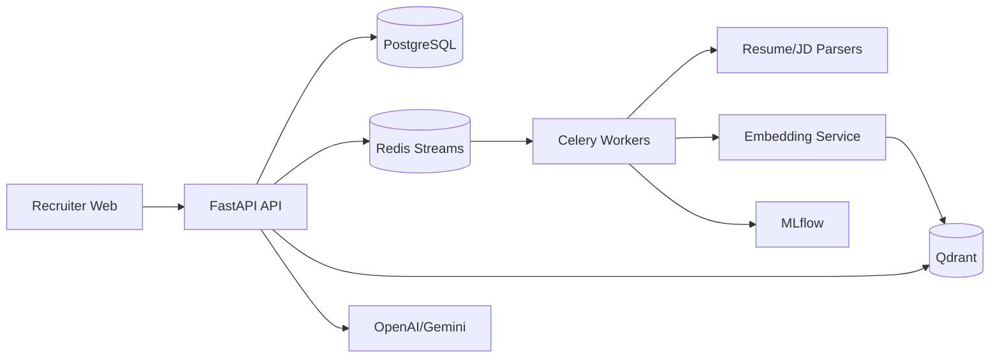
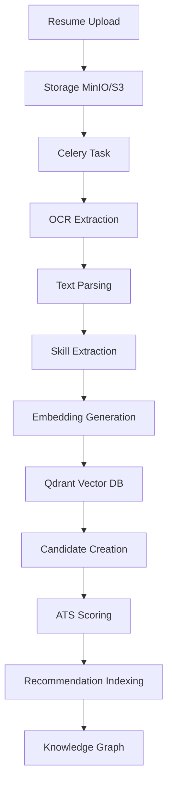
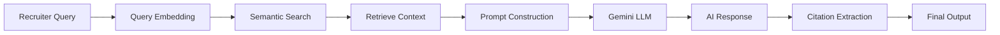
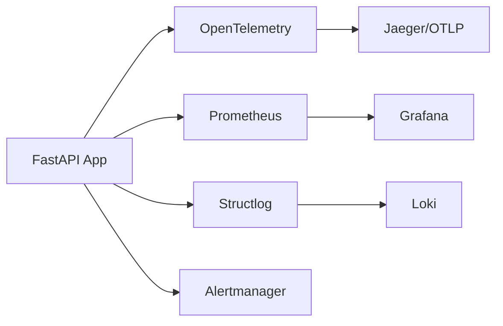
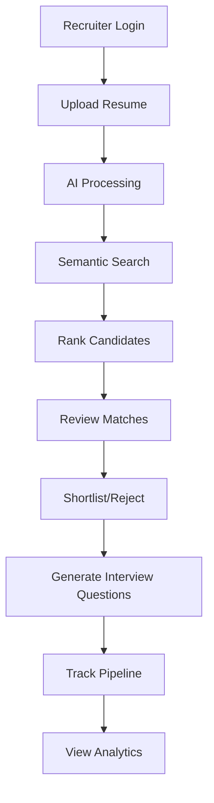

# Architecture

AI Resume Intelligence is a multi-tenant hiring intelligence platform built around FastAPI, PostgreSQL, Redis, Qdrant, MLflow, Celery, and Next.js.

## System Overview

All recruiter-facing APIs are tenant-aware and organization-scoped. Heavy AI work runs asynchronously through workers and events.

## AI Pipeline Architecture

## RAG Workflow

## Observability Stack

## Recruiter Workflow

## Tech Stack

### Backend
- **Framework**: FastAPI 0.115+
- **Language**: Python 3.11+
- **Database**: PostgreSQL 15+ with AsyncPG
- **Cache**: Redis 7+
- **Vector DB**: Qdrant 1.7+
- **Object Storage**: MinIO/S3
- **Task Queue**: Celery with Redis
- **ML Tracking**: MLflow
- **LLM**: Google Gemini 2.5
- **Embeddings**: sentence-transformers
- **OCR**: Tesseract/PDFPlumber

### Frontend
- **Framework**: Next.js 15
- **Language**: TypeScript 5.4+
- **UI**: React 18, TailwindCSS
- **State**: React Query, Zustand
- **Charts**: Recharts

### DevOps
- **Containerization**: Docker, Docker Compose
- **CI/CD**: GitHub Actions
- **Monitoring**: Prometheus, Grafana, Loki
- **Tracing**: OpenTelemetry, Jaeger
- **Security**: Bandit, pip-audit, Trivy

### Infrastructure
- **Reverse Proxy**: Nginx
- **Process Manager**: Uvicorn
- **Load Balancer**: Kubernetes (optional)
- **CDN**: Cloudflare (optional)

## Data Flow

### Resume Ingestion Flow
1. Recruiter uploads resume via frontend
2. Frontend sends file to backend API
3. Backend validates file and uploads to MinIO
4. Backend creates Resume record with status=queued
5. Backend triggers Celery task for async processing
6. Celery worker processes resume (OCR → parsing → embedding)
7. Worker updates Resume status to parsed
8. Worker creates Candidate record
9. Worker extracts and normalizes skills
10. Worker generates embeddings and stores in Qdrant
11. Worker calculates ATS score
12. Worker indexes for recommendations

### Semantic Search Flow
1. Recruiter enters search query
2. Frontend sends query to backend API
3. Backend converts query to embedding
4. Backend searches Qdrant for similar embeddings
5. Backend applies filters (skills, location)
6. Backend reranks results with lexical boost
7. Backend returns paginated results
8. Frontend displays results with scores

### AI Copilot Flow
1. Recruiter asks question
2. Frontend sends question to backend API
3. Backend converts question to embedding
4. Backend retrieves relevant context from Qdrant
5. Backend constructs prompt with context
6. Backend calls Gemini LLM
7. Backend extracts citations from response
8. Backend returns answer with citations and confidence
9. Frontend displays answer with highlighted citations

## Security Architecture

### Authentication
- JWT access tokens (30 min expiry)
- JWT refresh tokens (14 days expiry)
- Bcrypt password hashing
- Token refresh rotation

### Authorization
- Role-based access control (RBAC)
- Organization-level isolation
- Resource-level permissions
- API key authentication

### Data Protection
- Encryption at rest (MinIO)
- Encryption in transit (TLS)
- PII masking in logs
- Audit logging
- Data retention policies

### Network Security
- CORS configuration
- Rate limiting
- Request validation
- SQL injection prevention
- XSS protection
- CSRF protection

## Scalability

### Horizontal Scaling
- Stateless API servers
- Database read replicas
- Redis clustering
- Qdrant sharding
- Celery worker scaling

### Performance Optimization
- Async I/O throughout
- Connection pooling
- Query optimization
- Caching strategies
- CDN for static assets
- Lazy loading

### High Availability
- Health checks
- Graceful shutdown
- Circuit breakers
- Retry logic
- Dead letter queues
- Backup/restore procedures
