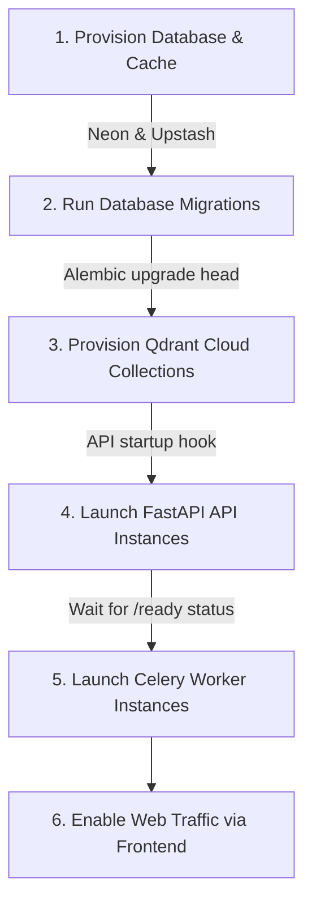

# Production Database Deployment & Startup Guide

This document describes the steps required to provision, migrate, and start the production database for the AI Resume Intelligence Platform.

## 1. Database Provisioning (Neon Serverless PostgreSQL)

1.  Create a project in the [Neon Console](https://console.neon.tech/).
2.  Choose the database version **PostgreSQL 16**.
3.  Configure two endpoints:
    *   **Direct connection**: Used for running Alembic schema migrations (does not go through PgBouncer, preventing transaction locking).
        *   *Format*: `postgresql+psycopg://<user>:<password>@ep-xxxxxx.us-east-1.aws.neon.tech/neondb`
    *   **Pooled connection**: Used by the live FastAPI application (routes through PgBouncer to manage high API connection concurrency).
        *   *Format*: `postgresql+asyncpg://<user>:<password>@ep-xxxxxx-pooler.us-east-1.aws.neon.tech/neondb`

---

## 2. Startup Order Sequence

To prevent initialization races (such as backend API crashing because the database is not ready or migrated), follow this exact startup order during deployment:



---

## 3. Database Migration Guide

Database schema updates are managed via Alembic. When deploying to production:

1.  **Do not run migrations automatically in the API container if scaling to multiple instances**. This causes concurrent transaction conflicts on the `alembic_version` table.
2.  Run the migrations as a single release phase task:
    ```bash
    # From apps/api directory, using the direct non-pooled connection URL
    alembic upgrade head
    ```
3.  **Rollback Plan**:
    If a migration fails or must be rolled back:
    ```bash
    # Downgrade by 1 revision
    alembic downgrade -1
    ```
