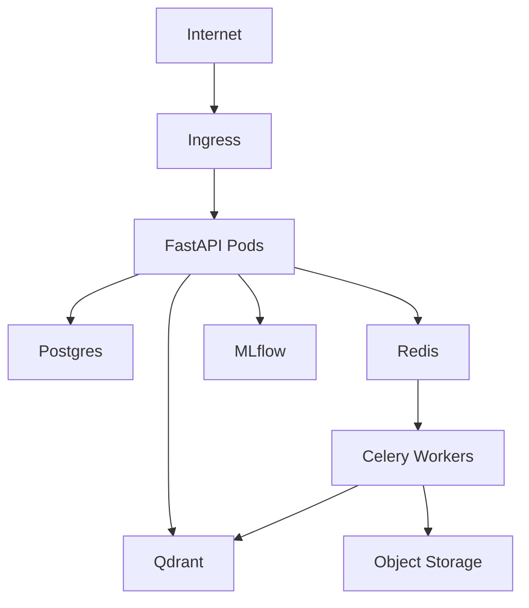

# Deployment



Deploy with Helm:

```bash
helm upgrade --install resume-intelligence infra/helm/resume-intelligence
```

Run database migrations before promoting traffic:

```bash
kubectl exec deploy/resume-api -- alembic upgrade head
```
