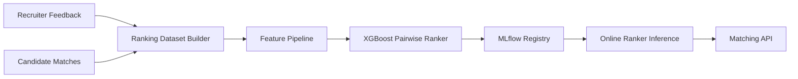

# ML Architecture

The ranking stack starts with auditable hybrid scoring and upgrades to a learning-to-rank model as feedback volume grows. Recruiter actions become reward labels, while feature snapshots keep training reproducible.
