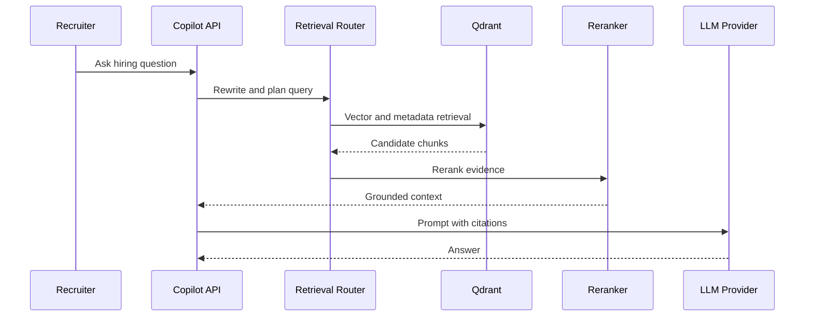

# RAG Architecture

```mermaid
sequenceDiagram
  participant R as Recruiter
  participant API as Copilot API
  participant Router as Retrieval Router
  participant Q as Qdrant
  participant Rerank as Reranker
  participant LLM as LLM Provider
  R->>API: Ask hiring question
  API->>Router: Rewrite and plan query
  Router->>Q: Vector and metadata retrieval
  Q-->>Router: Candidate chunks
  Router->>Rerank: Rerank evidence
  Rerank-->>API: Grounded context
  API->>LLM: Prompt with citations
  LLM-->>API: Answer
```

Prompt safety checks reject instruction-exfiltration patterns before retrieval or generation. Answers return candidate citations for recruiter verification.
